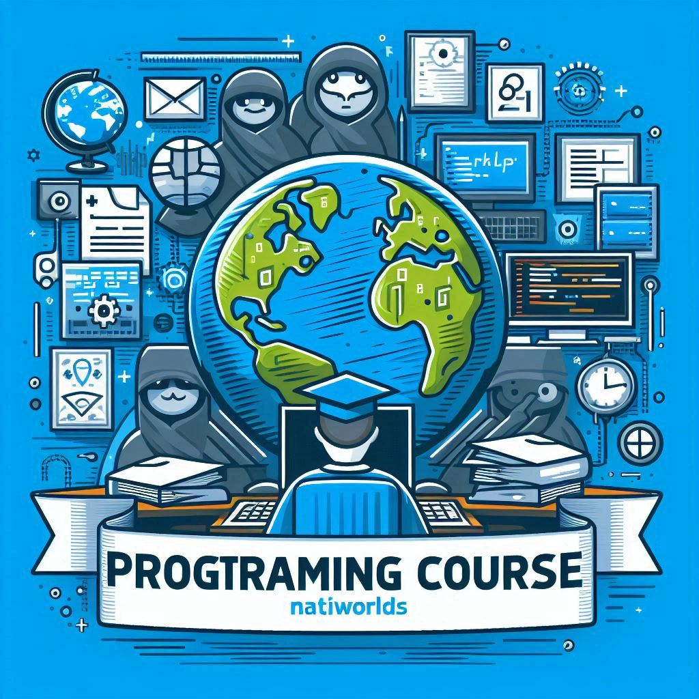

# ¡Practica tu Programación!

---

**Por** ➡️ **Natalia Cortés (Natiworlds)**

---

Bienvenido/a a este repositorio donde aprenderás las bases de la programación tanto funcional como orientada a objetos con Kotlin. Este curso está estructurado en varias secciones para facilitar tu aprendizaje.

## Contenidos
1. [Completar Código](#completar-código)
2. [Detectar Errores](#detectar-errores)
3. [Programación Orientada a Objetos (Poo)](#programación-orientada-a-objetos-poo)
4. [Proyecto Completo](#proyecto-completo)

---

## Completar Código
En esta sección, se presentan fragmentos de código a los que les falta alguna parte. Tu objetivo es identificar lo que falta y completarlo para que funcione correctamente.

### Estado de Compleción
- **Primer Nivel**: [Completado ✅]
- **Segundo Nivel**: [En proceso 🔄]

---

## Detectar Errores
Aquí encontrarás código completo que contiene errores en alguna de sus líneas. Tu tarea es identificar y corregir estos errores.

### Estado de Compleción
- **Primer Nivel**: [Completado ✅]
- **Segundo Nivel**: [En proceso 🔄]

---

## Programación Orientada a Objetos (Poo)
Esta sección cubre todos los conceptos relacionados con la programación orientada a objetos.

### Estado de Compleción
- **Primer Nivel**: [Completado ✅]
- **Segundo Nivel**: [En proceso 🔄]

---

## Proyecto Completo
En esta sección, construiremos un programa completo con interfaz gráfica (GUI), salida a consola y estructura de proyecto con una base de datos relacional, siguiendo las bases aprendidas en el grado superior de Desarrollo de Aplicaciones Web.

### Estado de Compleción
- **Primer Nivel**: [Este apartado será el último en presentarse ⏳]

---

## Cómo Contribuir
¡Nos encantaría tu ayuda para mejorar este proyecto! Si tienes ideas, sugerencias o encuentras algún error, por favor, abre un issue o un pull request.

---

## Contacto
Si tienes alguna pregunta o necesitas ayuda, no dudes en contactarme a través de mis redes sociales o correo electrónico.

---

¡Gracias por unirte a este viaje de aprendizaje! 🚀
